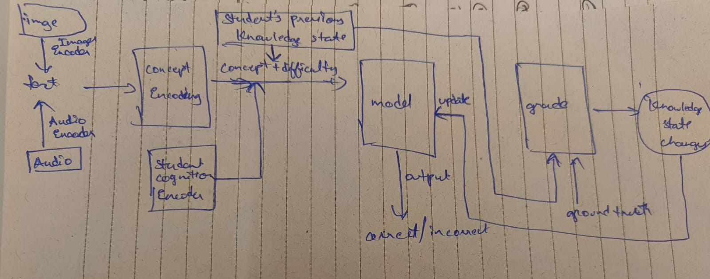

### Current model-architecture

1. Different encoders for differnt type of input data, image, video, audio etc, which will convert the data into text. 
2. The text is passed into a context encoder, which is supposed to take text as input and produce the set of concept mapppings with relavence and difficulty mapping to each concept.
3. The student module, which encodes the student cognition and his current state outputs an embedding to aid the model.
4. The concept mappings along with student embedding and student's current knowledge state are passed to the model to produce the binary output, if the student answers it right or wrong.
5. The output + student knowledge state + ground truth is passed to the grader module to give the student knowledge state changes.
6. The student knowledge state changes applied on the student knowledge state to update.

Advantages:
1. Better interpretability because of the knowledge states
2. Major shift from passing previous interactions to current knowledge state as the input parameter to the model.
3. Dynamic creation and updation of the tags without the need on relying on the dataset.
4. Encoporating difficulty and relavence rating to better track multiple concepts.
5. Encorporating students cognition and current state of mind into account.
6. Better failure analysis with the help of grader module, and tracing the knowledge states changes with it.
7. Multi-modality support.